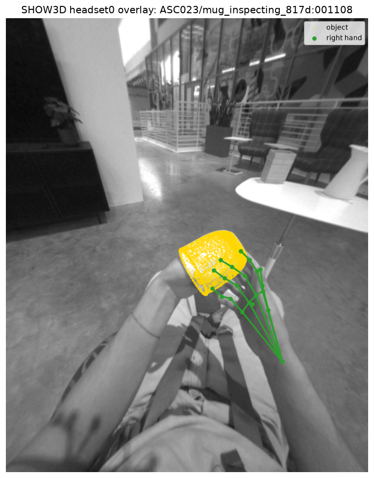
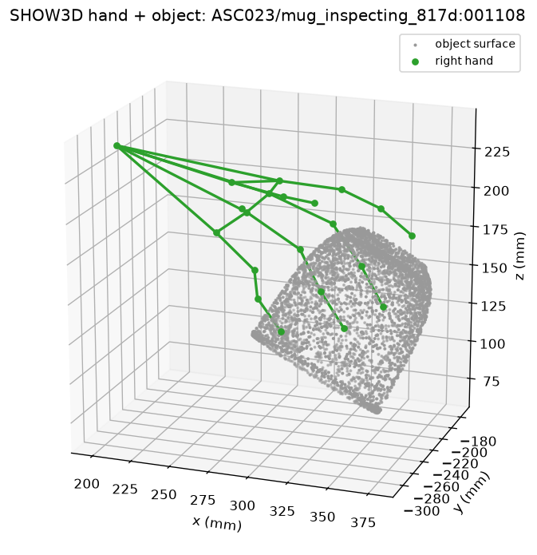
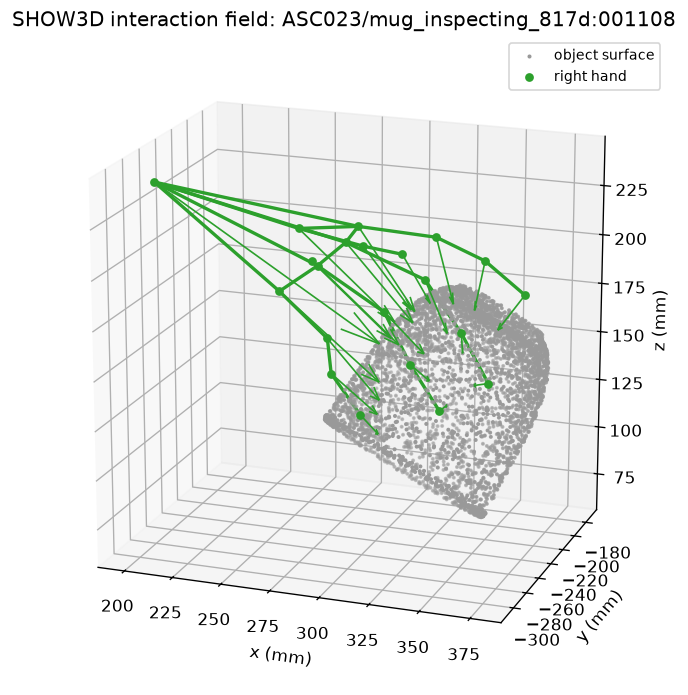

# SHOW3D dataset API

Standalone Python starter APIs for the SHOW3D dataset (`facebook/show3d-dataset`).

## Install

```bash
pip install -r requirements.txt
# or: pip install numpy opencv-python   (add matplotlib for the visualization demo)
```

## The dataset

Download SHOW3D from Hugging Face:
[`facebook/show3d-dataset`](https://huggingface.co/datasets/facebook/show3d-dataset).
`show3d.dataset` is the generic, task-agnostic loader: frame references and
manifest JSONL helpers, path resolution, and per-frame object-pose / hand-pose /
calibration loading. Point it at your local mirror:

```python
from show3d.dataset import Show3DDataset

dataset = Show3DDataset.from_manifest_jsonl("/path/to/show3d", "manifest.jsonl")
frame = dataset[0]   # views (video paths + calibration), object_pose, left/right hand
```

The loader expects the released on-disk layout under `root`:

```
<root>/
├── scenes/<subject>/<scene>/
│   ├── headset0.mp4, headset1.mp4              # egocentric videos
│   ├── camera_calibration/headset{0,1}.json   # intrinsics + per-frame pose
│   └── metadata/frame_info.json
├── object_pose/<version>/scenes/<subject>/<scene>/object_pose.json
└── hand_pose/<version>/scenes/<subject>/<scene>/hand_pose.json
```

## Interaction Field Estimation challenge

The Interaction Field Estimation Challenge is hosted at the HANDS workshop at ECCV
2026: predict a per-frame, hand-anchored 3D interaction field. Its API, the
end-to-end demo, a baseline template, and evaluation live in
[`show3d/interaction_field/README.md`](show3d/interaction_field/README.md).

## Visualize a frame

`show3d.demo_viz` renders three views of a frame (needs `matplotlib`); the
projection and drawing primitives live in `show3d.camera` and `show3d.viz`:

```bash
python -m show3d.demo_viz --mode overlay  --out overlay.png    # skeleton + object on the frame
python -m show3d.demo_viz --mode geometry --out geometry.png   # 3D skeleton + object
python -m show3d.demo_viz --mode field    --out field.png      # 3D interaction field
```

Add `--root DIR --manifest MANIFEST.jsonl` to visualize your own mirror (overlay
decodes the frame).

**overlay**: the hand skeleton and object projected onto the egocentric frame.



**geometry**: the hand skeleton and object surface in 3D. **field**: the
interaction field, arrows from each hand joint to the nearest object point.





## Extracting frames for training

Random per-frame video seeking is slow, so training straight from the MP4s is
decode-bound. Pre-extract the frames you need, at an fps **you choose**, into a
random-access image store:

```bash
python -m show3d.extract_images --root /path/to/show3d --out frames/ --fps 10 \
    --manifest show3d/interaction_field/train_manifest_202607.jsonl
# --views headset0 | --format png | --quality 80 | --workers 16
```

`--manifest` is the reproducible way to pick scenes: it ships at
`show3d/interaction_field/train_manifest_202607.jsonl` and lists the exact
interaction-field **training** recordings (train subjects only). Without it the
tool walks `<root>/scenes` and keeps scenes that have object-pose GT.

`--fps` is required and has no default: it dominates dataset size and temporal
coverage. It must be a whole number that divides the 60 fps source (1, 2, 3, 4,
5, 6, 10, 12, 15, 20, 30, 60); other values are rejected. The tool decodes each
recording once (sequential, no seeking), writes grayscale JPEGs (or PNG with
`--format png`) to `frames/<subject>/<scene>/<view>/<frame>.jpg` plus an
`index.jsonl` a map-style training `Dataset` can shuffle over. As a rough size
guide, 10 fps is tens of GB single-view (about 100 GB both views).

## Repository layout

```
show3d/
├── dataset.py                    # generic SHOW3D dataloader API
├── demo_viz.py                   # visualization: interaction field -> PNG
├── extract_images.py             # pre-extract frames to images at a chosen fps
├── interaction_field/
│   ├── README.md                 # the challenge: task, demos, baseline, eval
│   ├── train_manifest_202607.jsonl   # exact training recordings (train subjects)
│   ├── __init__.py               # interaction-field challenge API
│   └── demo.py                   # end-to-end demo: load -> model -> eval
├── assets/objects/               # bundled object meshes (.glb, HOT3D-derived)
└── tests/                        # unit tests
```

## Running the tests

```bash
python -m unittest discover
```

## License

The code and the bundled object meshes are released under Creative Commons
Attribution-NonCommercial 4.0 International (CC BY-NC 4.0); see `LICENSE`. The
bundled meshes are derived from the HOT3D object models (BOP HOT3D release,
`object_models_eval`); see `show3d/assets/objects/ATTRIBUTION.md`.

## Citation

If you use SHOW3D, please cite:

```bibtex
@article{rim2026show3d,
  title   = {SHOW3D: Capturing Scenes of 3D Hands and Objects in the Wild},
  author  = {Rim, Patrick and Harris, Kevin and Copple, Braden and Han, Shangchen and
             Xie, Xu and Shugurov, Ivan and An, Sizhe and Wen, He and
             Wong, Alex and Hodan, Tomas and others},
  journal = {arXiv preprint arXiv:2603.28760},
  year    = {2026}
}
```
