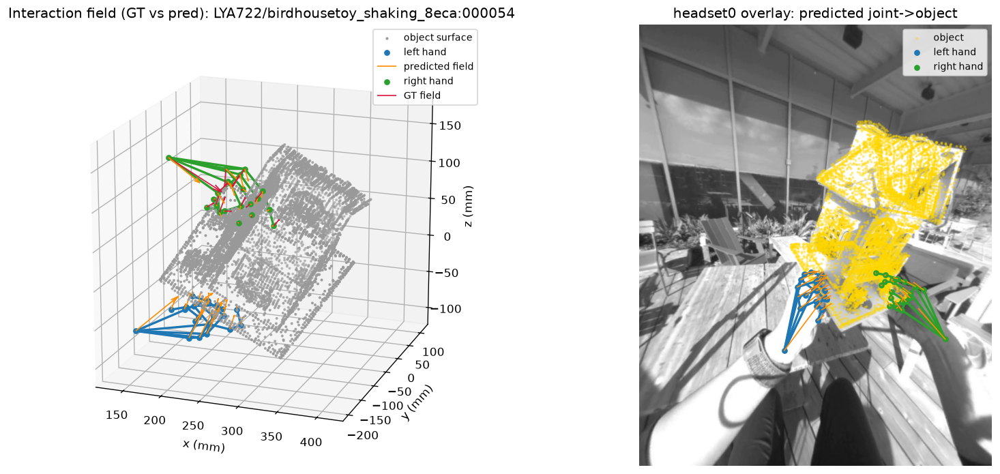

# InterField baseline (SHOW3D interaction-field challenge)

A reference baseline for the SHOW3D Interaction Field Estimation Challenge: a
single-image regressor that predicts, for each hand, the `(21, 3)` hand-anchored
interaction field (the vector from each of the 21 hand joints to the nearest
object-surface point). The architecture follows the **InterField** model from
ARCTIC (Fan et al., CVPR 2023): a ResNet-50 image encoder and an MLP field head.
It is trained and evaluated on **SHOW3D, headset0 (single view)**.

This is a *reference point*, not a tuned state-of-the-art system — it is meant to
be simple, reproducible, and easy to build on.

The released checkpoint is trained on **all 10 training subjects**. As a
generalization estimate, a leave-2-subjects-out dev run reaches mean ADE
**60.5 mm** (recall 1.000, acc@50mm 0.68, acc@100mm 0.86, ACC 0.10 m/s²); the
official test-subject labels are withheld, so this dev split stands in for the
test set. See [`RESULTS.md`](RESULTS.md) for the full table and baselines. Example
prediction vs. ground-truth renders are in [`examples/`](examples/).



## What it predicts, and the camera-frame trick

The target field is a set of 3D vectors in **world space**. But a single hand
image does not reveal the world's (gravity-aligned) orientation, so regressing a
world-frame vector directly is ill-posed. Since SHOW3D ships the per-frame
`R_world_from_camera` (in `camera_calibration/headset0.json`, and also exposed on
every `ViewFrame.calibration`) at both train and test time, the model instead
regresses the field in the **camera frame** — where a vector's direction is tied
to what the camera sees — and we rotate it back to world:

```
V_camera = R_world_from_camera^T @ V_world      # target built for training
V_world  = R_world_from_camera   @ V_camera     # prediction written to submission
```

The translation cancels because the field is a difference of two world points, so
this is exact and view-consistent. Because the rotation is orthogonal, the
camera-frame endpoint error equals the world-space ADE, so the validation number
printed during training is directly comparable to the official evaluator.

The baseline **always predicts both hands** (it never abstains), so its recall is
1.0 by construction — matching the challenge's guidance that a valid target left
unpredicted is penalized.

## Files

| File | Role |
| --- | --- |
| `model.py` | `InterFieldModel` (ResNet-50 + MLP head) and the masked ADE loss |
| `data.py` | `InterFieldFrameDataset`: joins extracted frames + labels + calibration, builds camera-frame targets |
| `train.py` | training loop (multi-GPU `DataParallel`), subject-level train/val split |
| `predict.py` | run the model → `predictions.jsonl` (world frame), from extracted frames or straight from the MP4s |
| `evaluate.py` | official ADE / recall / acc@k + the paper's ACC (m/s²) temporal metric |
| `visualize.py` | render predicted vs. ground-truth field (3D arrows + egocentric overlay) |

## End-to-end

Assumes a local SHOW3D mirror at `$ROOT` with `scenes/` (headset0 videos +
`camera_calibration/`), `object_pose/v1`, and `hand_pose/v2` for the training
subjects (the manifest `train_manifest_202607.jsonl` names them).

### 1. Extract frames + labels (10 fps, headset0)

```bash
python -m show3d.extract_images \
    --root $ROOT --out $FRAMES --fps 10 --views headset0 \
    --manifest show3d/interaction_field/train_manifest_202607.jsonl \
    --save-labels
```

### 2. Train

The **released checkpoint trains on all 10 subjects** (pass no `--val-subjects`),
so no labeled data is wasted:

```bash
CUDA_VISIBLE_DEVICES=0,1,2 python -m show3d.interaction_field.baseline.train \
    --frames-dir $FRAMES --root $ROOT --val-subjects \
    --epochs 20 --batch-size 256 --weight-decay 5e-4 \
    --out checkpoints/interfield.pt
```

To instead measure cross-subject generalization, hold two subjects out —
`--val-subjects XYZ109 LYA722` — which trains on the other 8 and reports
validation ADE (mm) each epoch, saving the best-by-val checkpoint (this is how the
numbers in [`RESULTS.md`](RESULTS.md) were produced).

### 3. Predict + evaluate on the held-out split

```bash
python -m show3d.interaction_field.baseline.predict \
    --checkpoint checkpoints/interfield.pt --root $ROOT \
    --frames-dir $FRAMES --subjects XYZ109 LYA722 \
    --out predictions_val.jsonl

python -m show3d.interaction_field.baseline.evaluate \
    --labels $FRAMES/labels.jsonl --predictions predictions_val.jsonl \
    --subjects XYZ109 LYA722 --fps 10
```

`predict.py` also has a `--manifest` mode that decodes headset0 frames directly
from the MP4s — the exact path a participant runs to produce a submission.

### 4. Visualize

```bash
python -m show3d.interaction_field.baseline.visualize \
    --checkpoint checkpoints/interfield.pt \
    --root $ROOT --manifest some_manifest.jsonl --index 0 \
    --out baseline_field.png
```

(With no `--root/--manifest` it renders the bundled synthetic scene, so you can
smoke-test the plotting without any data.)

### Produce a test submission

`predict --manifest` runs the model over any per-frame manifest — including the
challenge **test manifest** — decoding headset0 frames straight from the MP4s and
writing a `predictions.jsonl` in the official schema. Validate it with the repo's
checker before uploading:

```bash
# 1. download the test scenes' videos + calibration into $ROOT (no labels needed)
# 2. run the released model over the test manifest
python -m show3d.interaction_field.baseline.predict \
    --checkpoint checkpoints/interfield_show3d_headset0.pt --root $ROOT \
    --manifest show3d/interaction_field/test_manifest_5fps_202607.jsonl \
    --out predictions.jsonl

# 3. self-check (shape + sample_id coverage), then upload predictions.jsonl
python -m show3d.interaction_field.validate_submission \
    --manifest show3d/interaction_field/test_manifest_5fps_202607.jsonl \
    --submission predictions.jsonl
```

The predictor emits both hands for every frame with a valid extrinsic, so the
submission passes `validate_submission` and keeps recall high.

## Hand-crop variant (`crop_baseline.py`)

An ARCTIC-style **per-hand crop** variant: instead of the whole frame, it feeds a
square crop around each hand (resized to 224²) and regresses that hand's field.
It lowers ADE ~10 % (see [`RESULTS.md`](RESULTS.md)), but boxes each hand from the
**ground-truth hand pose** — which is withheld at test time — so it is an
**oracle-box upper-bound reference**, not a directly-submittable model (a real
submission would supply boxes from a hand detector). The full-frame model above is
the submittable baseline.

```bash
# 1. one-off: project GT hand joints -> per-frame 2D boxes (frames/hand_boxes.jsonl)
python -m show3d.interaction_field.baseline.crop_baseline precompute-boxes \
    --frames-dir $FRAMES --root $ROOT

# 2. train the per-hand model
CUDA_VISIBLE_DEVICES=0,1,2 python -m show3d.interaction_field.baseline.crop_baseline train \
    --frames-dir $FRAMES --root $ROOT --val-subjects XYZ109 LYA722 \
    --epochs 25 --out checkpoints/interfield_crop.pt

# 3. predict (assembles both hands per frame) and score with the same evaluators
python -m show3d.interaction_field.baseline.crop_baseline predict \
    --frames-dir $FRAMES --root $ROOT --subjects XYZ109 LYA722 \
    --checkpoint checkpoints/interfield_crop.pt --out predictions_crop.jsonl
python -m show3d.interaction_field.baseline.evaluate --labels $FRAMES/labels.jsonl --predictions predictions_crop.jsonl --subjects XYZ109 LYA722
```

## Notes / knobs

* **Single view, grayscale.** `extract_images` writes grayscale JPEGs; the model
  replicates gray to 3 channels for the ImageNet-pretrained backbone. This is the
  challenge's provided fast path; color would require decoding from the MP4s.
* **Input.** The full 1408² frame is resized to 224². A stronger baseline could
  crop around the hands (SHOW3D provides hand poses to derive a box).
* **Split.** Official test-subject labels are withheld, so the reference number
  uses a subject-level held-out split of the *train* subjects — a genuine
  cross-subject generalization estimate, not a memorization check.
